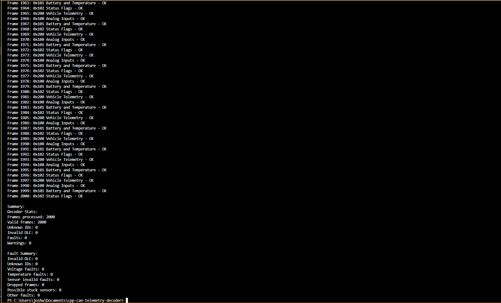

# Waveshare Live CAN Ingestion Test

## Goal

Validate that the desktop C++ application can directly consume live hardware-generated CAN frames from the Waveshare USB-CAN workflow without manual CSV conversion.

---

## Test Setup

```text
STM32 board: NUCLEO-G431RB
Firmware: STM32 FreeRTOS CAN telemetry sender
CAN transceiver: SN65HVD230
USB-CAN adapter: Waveshare USB-CAN
CAN bitrate: 500 kbps
CAN frame type: Standard Classic CAN
DLC: 8 bytes
Desktop input backend: WaveshareSerialFrameSource
Operating system: Windows
```

---

## Live Hardware Path

```text
STM32 FreeRTOS sender
        ↓
SN65HVD230 CAN transceiver
        ↓
Waveshare USB-CAN adapter
        ↓
Windows COM port
        ↓
WaveshareSerialFrameSource
        ↓
CanFrame
        ↓
run_decoder_live()
        ↓
process_frame()
        ↓
CanDispatcher
        ↓
TelemetryDecoder
        ↓
FaultAnalyzer
        ↓
terminal summary
        ↓
output/fault_summary.json
        ↓
Diagnostic report agent
        ↓
output/diagnostic_report.md
```

---

## Command Used

```powershell
.\main.exe --waveshare-serial COM4 2000
```

`COM4` should be replaced with the COM port assigned to the Waveshare USB-CAN adapter.

---

## Extended Live Demo Result

```text
Frames processed: 2000
Valid frames: 2000
Unknown IDs: 0
Invalid DLC: 0
Faults: 0
Warnings: 0
Dropped frames: 0
```

Because the STM32 firmware transmits four CAN frame types per transmit cycle, a 2,000-frame run represents 500 telemetry cycles.

```text
2000 total frames / 4 frame types = 500 telemetry cycles
```

---

## Terminal Summary Screenshot



---

## Interpretation

The desktop C++ application successfully received and decoded 2,000 live STM32-generated CAN frames through the Waveshare USB-CAN serial backend.

The decoder recognized all expected CAN IDs:

```text
0x100 Analog Inputs
0x101 Battery and Temperature
0x102 Status Flags
0x200 Vehicle Telemetry
```

No unknown IDs, invalid DLC errors, dropped counters, diagnostic faults, or warnings were detected.

---

## Output Files

The decoder writes a structured JSON summary:

```text
output/fault_summary.json
```

The diagnostic report agent reads that JSON summary and writes:

```text
output/diagnostic_report.md
```

---

## Demo Media

Short screen recordings were captured for:

```text
Waveshare receive workflow
C++ live decoder 2,000-frame run
```

The root README links the current muted demo videos from the `media/` folder.

---

## Current Limitations

```text
The live Waveshare serial reader is implemented for the current Windows/Waveshare workflow.
Linux SocketCAN can0 support is future work.
The firmware currently generates simulated telemetry rather than real ADC sensor values.
The serial backend works for the demo workflow but does not yet include production-grade reconnect/recovery behavior.
```
