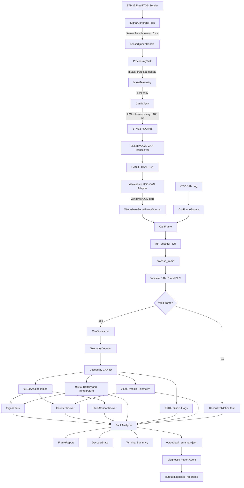

# Software Data Flow

This document shows how CAN frames move through the full C++/STM32 telemetry system.

The same desktop decoder pipeline is used for both CSV logs and live Waveshare USB-CAN input. The input backend changes, but every received frame is normalized into a `CanFrame` before validation, dispatch, decoding, statistics tracking, and fault analysis.

---

## Full System Flow



---

## Live Hardware Path

```text
STM32 FreeRTOS sender
        ↓
SN65HVD230 CAN transceiver
        ↓
Waveshare USB-CAN adapter
        ↓
Windows COM port
        ↓
WaveshareSerialFrameSource
        ↓
CanFrame
        ↓
run_decoder_live()
        ↓
process_frame()
        ↓
CanDispatcher
        ↓
TelemetryDecoder
        ↓
FaultAnalyzer
        ↓
terminal summary
        ↓
output/fault_summary.json
        ↓
Diagnostic report agent
        ↓
output/diagnostic_report.md
```

---

## CSV Path

```text
CSV CAN log
        ↓
CsvFrameSource
        ↓
CanFrame
        ↓
run_decoder_live()
        ↓
process_frame()
        ↓
CanDispatcher
        ↓
TelemetryDecoder
        ↓
FaultAnalyzer
        ↓
terminal summary
        ↓
output/fault_summary.json
        ↓
Diagnostic report agent
        ↓
output/diagnostic_report.md
```

---

## Implemented Backends

```text
CsvFrameSource: reads project CSV CAN logs
WaveshareSerialFrameSource: reads live Waveshare USB-CAN serial packets on Windows
```

---

## Future Work

```text
Linux SocketCAN can0 backend
candump parser
production-grade serial reconnect/error recovery
real ADC sensor telemetry on STM32
```
