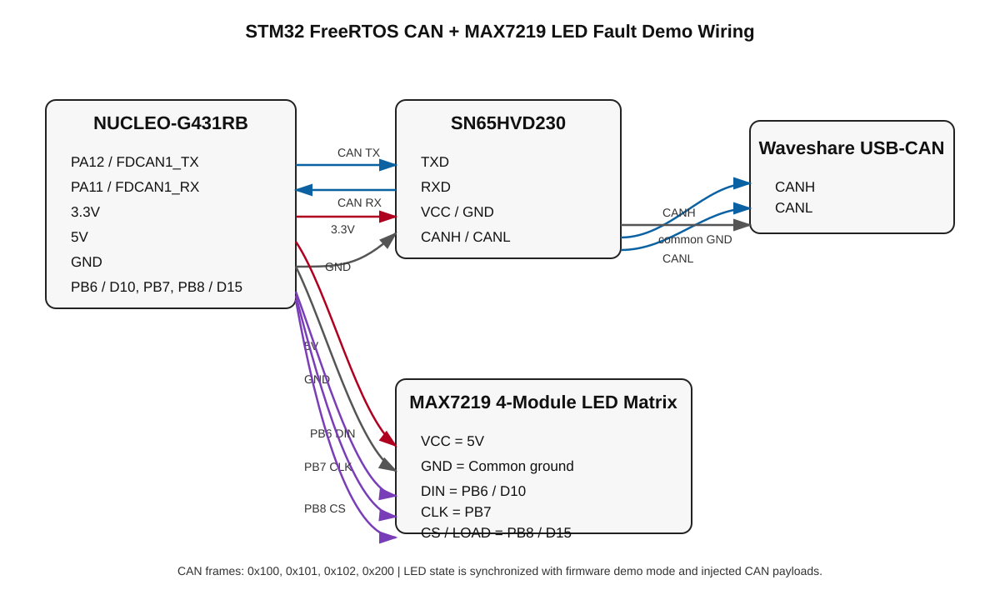
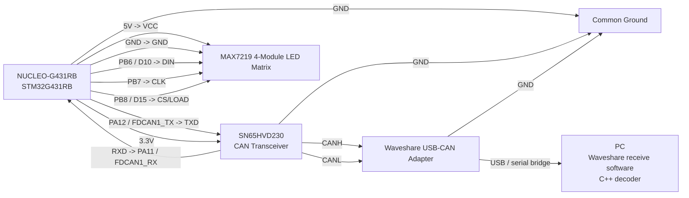

# STM32 FreeRTOS CAN + MAX7219 LED Fault Demo Wiring

This note documents the full live-demo wiring used for the STM32 FreeRTOS CAN sender, Waveshare USB-CAN receive path, C++ decoder, and MAX7219 LED matrix fault display.

The LED matrix is not a separate decoder output. It is a firmware-side visual status display. The STM32 firmware drives the LED matrix and also injects matching CAN payload values from the same demo mode, so the LED state and desktop decoder output stay synchronized.

## Hardware used

- NUCLEO-G431RB
- SN65HVD230 CAN transceiver
- Waveshare USB-CAN adapter
- 4-module MAX7219 LED matrix
- PC running the Waveshare receive software and/or the C++ live CAN decoder
- Common ground between the STM32 board, CAN transceiver, USB-CAN adapter, and LED matrix

## Updated wiring schematic

**Figure 1. STM32 FreeRTOS CAN and MAX7219 LED fault demo wiring.** The NUCLEO-G431RB sends CAN frames through the SN65HVD230 transceiver to the Waveshare USB-CAN adapter, while the MAX7219 LED matrix displays the current firmware demo fault state. The PC receives the CAN traffic through the Waveshare adapter and the C++ decoder reports the corresponding faults.

## CAN wiring

| NUCLEO-G431RB | SN65HVD230 | Notes |
|---|---|---|
| 3.3V | VCC | SN65HVD230 logic supply |
| GND | GND | Common ground |
| PA12 / FDCAN1_TX | TXD | STM32 CAN transmit into transceiver |
| PA11 / FDCAN1_RX | RXD | STM32 CAN receive from transceiver |
| - | CANH | Connects to Waveshare CANH |
| - | CANL | Connects to Waveshare CANL |

## Waveshare USB-CAN wiring

| SN65HVD230 | Waveshare USB-CAN adapter | Notes |
|---|---|---|
| CANH | CANH | CAN high line |
| CANL | CANL | CAN low line |
| GND | GND | Shared ground reference |
| 120 Ω termination | Across CANH/CANL | Termination for stable CAN signaling |

## MAX7219 LED matrix wiring

| NUCLEO-G431RB | MAX7219 module | Notes |
|---|---|---|
| 5V | VCC | LED matrix module supply |
| GND | GND | Common ground with STM32/CAN setup |
| PB6 / D10 | DIN | Bit-banged serial data |
| PB7 | CLK | Bit-banged clock |
| PB8 / D15 | CS / LOAD | Chip-select/load signal |

## Demo startup behavior

At power-up, the STM32 firmware starts FreeRTOS and the MAX7219 display runs a scanner sweep animation. The fault demo does not begin immediately. The firmware waits for the NUCLEO user button.

After the user button is pressed:

1. `demoStarted` becomes true.
2. `DisplayTask` leaves the scanner sweep startup loop.
3. `FaultInjectTask` begins cycling through demo fault modes.
4. `CanTxTask` reads the same demo mode and injects matching fault values into the CAN payload before transmission.
5. The C++ decoder receives those frames through the Waveshare adapter and reports the matching fault summary.

## LED state to decoder behavior

| LED state | Firmware mode | CAN payload effect | Decoder result |
|---|---|---|---|
| Check mark | `DEMO_MODE_NORMAL` | Normal battery, temperature, and status values | Clean telemetry |
| Exclamation mark | `DEMO_MODE_HIGH_TEMP` | `temperature_deciC = 950` | High-temperature fault |
| X symbol | `DEMO_MODE_LOW_VOLTAGE` | `battery_mV = 9500` | Low-voltage fault |
| X symbol | `DEMO_MODE_SENSOR_INVALID` | `status = 0x06` | Sensor-invalid fault |

## Important design note

The LED matrix does not send data to the PC decoder. Instead, both the LED output and the CAN fault payload are driven by the STM32 firmware's shared demo mode. This makes the visual display and decoder output synchronized while keeping the CAN pipeline realistic: the desktop program only sees CAN frames.

## Mermaid wiring reference

