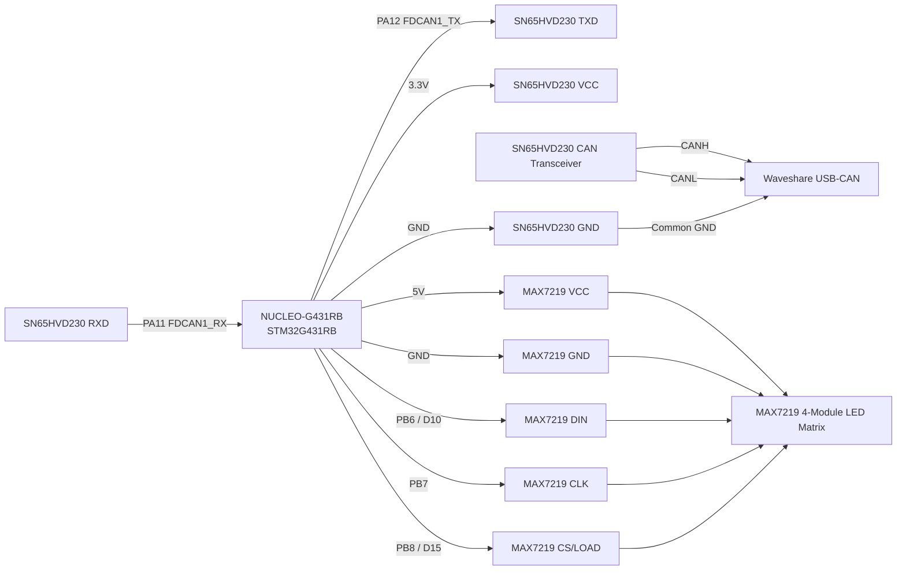

# STM32 FreeRTOS LED Fault Demo Wiring

This note documents the added MAX7219 LED matrix wiring used for the button-gated FreeRTOS fault demo.

## Hardware used

- NUCLEO-G431RB
- SN65HVD230 CAN transceiver
- Waveshare USB-CAN adapter
- 4-module MAX7219 LED matrix
- Common ground between STM32 board, CAN transceiver, USB-CAN adapter, and LED matrix

## CAN wiring

| NUCLEO-G431RB | SN65HVD230 | Notes |
|---|---|---|
| 3.3V | VCC | SN65HVD230 logic supply |
| GND | GND | Common ground |
| PA12 / FDCAN1_TX | TXD | STM32 CAN transmit into transceiver |
| PA11 / FDCAN1_RX | RXD | STM32 CAN receive from transceiver |
| - | CANH | Connects to Waveshare CANH |
| - | CANL | Connects to Waveshare CANL |

## MAX7219 LED matrix wiring

| NUCLEO-G431RB | MAX7219 module | Notes |
|---|---|---|
| 5V | VCC | LED matrix module supply |
| GND | GND | Common ground with STM32/CAN setup |
| PB6 / D10 | DIN | Bit-banged serial data |
| PB7 | CLK | Bit-banged clock |
| PB8 / D15 | CS / LOAD | Chip-select/load signal |

## Demo behavior

The LED matrix is controlled by a FreeRTOS `DisplayTask`. At startup, the display runs a scanner sweep animation while the firmware waits for the NUCLEO user button. After the button is pressed, `FaultInjectTask` begins cycling through demo fault modes. `CanTxTask` uses the same mode to inject matching CAN payload values before sending frames.

| LED state | Firmware mode | CAN payload effect | Decoder result |
|---|---|---|---|
| Check mark | `DEMO_MODE_NORMAL` | Normal battery, temperature, and status values | Clean telemetry |
| Exclamation mark | `DEMO_MODE_HIGH_TEMP` | `temperature_deciC = 950` | High-temperature fault |
| X symbol | `DEMO_MODE_LOW_VOLTAGE` | `battery_mV = 9500` | Low-voltage fault |
| X symbol | `DEMO_MODE_SENSOR_INVALID` | `status = 0x06` | Sensor-invalid fault |

## Updated wiring diagram

