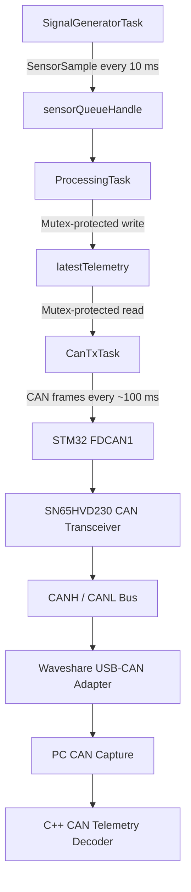

# STM32 FreeRTOS Architecture

This document explains the FreeRTOS architecture used by the STM32 CAN telemetry sender.

The firmware runs on the STM32 NUCLEO-G431RB and sends simulated telemetry frames over CAN through an SN65HVD230 transceiver to a Waveshare USB-CAN adapter.

---

## High-Level Architecture

```text
SignalGeneratorTask
        ↓
sensorQueueHandle
        ↓
ProcessingTask
        ↓
telemetryMutexHandle protects latestTelemetry
        ↓
CanTxTask
        ↓
STM32 FDCAN
        ↓
SN65HVD230 CAN transceiver
        ↓
Waveshare USB-CAN adapter
        ↓
PC captured CAN log
        ↓
C++ CAN Telemetry Decoder
```

---

## Mermaid Diagram



---

## Task Responsibilities

The firmware uses four FreeRTOS tasks:

```text
SignalGeneratorTask
ProcessingTask
CanTxTask
StatusLedTask
```

### SignalGeneratorTask

`SignalGeneratorTask` generates fake live telemetry values.

It runs approximately every:

```text
10 ms
```

It creates a `SensorSample` containing:

```text
AIN1 raw value
AIN2 raw value
AIN3 raw value
battery_mV
temperature_deciC
speed_raw
rpm
gear
throttle_percent
brake_percent
status
timestamp_ms
```

It sends the sample into:

```text
sensorQueueHandle
```

It does not transmit CAN frames directly.

---

### ProcessingTask

`ProcessingTask` waits on:

```text
sensorQueueHandle
```

When a `SensorSample` is received, it copies the data into:

```text
latestTelemetry
```

The write is protected by:

```text
telemetryMutexHandle
```

This prevents `CanTxTask` from reading partially updated telemetry.

---

### CanTxTask

`CanTxTask` reads `latestTelemetry` using the mutex.

It copies the shared telemetry into a local variable, releases the mutex, and then sends CAN frames.

This prevents the task from holding the mutex while transmitting multiple CAN frames.

`CanTxTask` sends:

```text
0x100 = Analog Inputs
0x101 = Battery and Temperature
0x102 = Status Flags
0x200 = Vehicle Telemetry
```

It owns the CAN transmit counter.

---

### StatusLedTask

`StatusLedTask` toggles the board LED as a heartbeat.

Current LED function:

```c
BSP_LED_Toggle(LED_GREEN);
```

Blink period:

```text
500 ms
```

---

## FreeRTOS Objects

The firmware uses:

```text
sensorQueueHandle
telemetryMutexHandle
latestTelemetry
```

### sensorQueueHandle

The queue transfers generated telemetry samples from `SignalGeneratorTask` to `ProcessingTask`.

### telemetryMutexHandle

The mutex protects shared telemetry data.

### latestTelemetry

`latestTelemetry` stores the latest processed telemetry values that will be sent by `CanTxTask`.

---

## Counter Ownership

The CAN transmit counter is owned by:

```text
CanTxTask
```

Reason:

```text
SignalGeneratorTask runs every 10 ms.
CanTxTask sends CAN frames about every 100 ms.
```

If the generator counter were used as the CAN frame counter, the transmitted counter could jump by about 10 each transmit cycle.

That would make the desktop C++ decoder falsely report dropped frames.

Correct design:

```text
SignalGeneratorTask may use a fake internal sample counter.
CanTxTask owns the CAN transmit counter.
```

---

## CAN Transmit Behavior

`CanTxTask` sends a burst of four frames:

```text
0x100
0x101
0x102
0x200
```

Small delays are inserted between sends to avoid filling the FDCAN transmit FIFO.

This fixed the issue where `0x200` was initially missing from the Waveshare receive output.

---

## Current Limitation

This firmware sends simulated telemetry values.

It does not yet read real ADC sensor inputs.

The PC-side C++ application currently reads captured CSV logs, not live USB-CAN traffic directly.